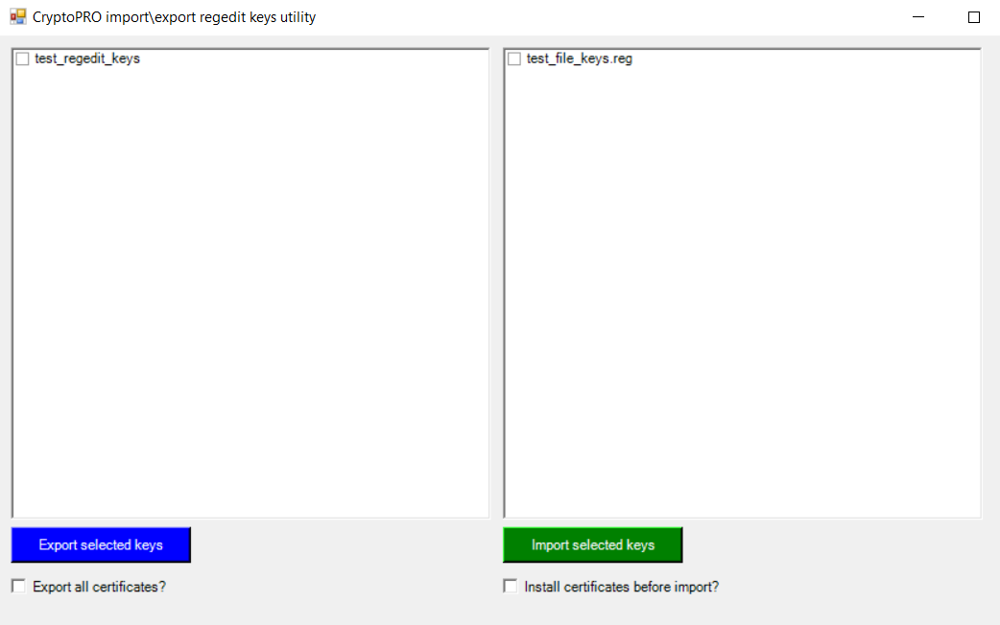

# Powershell-CryptoPRO-Copy-Keys
(RU) Данный скрипт был написан для массоового копирования\установки\переноса контейнеров закрытых ключей расположенных в реестре windows с одного ПК на другой. Автор не несет ответственности за любые последствия в результате установки и использования данного скрипта, пользователь использует его "как есть" на свой страх и риск.

(EN) This script was written for bulk copying \ installing \ transferring private key containers located in the windows registry from one PC to another. The author is not responsible for any consequences as a result of the installation and use of this script, the user uses it "as is" at his own peril and risk.

----

**Usage:** *powershell.exe -noexit -ExecutionPolicy Bypass -File cryptopro_key_copy.ps1*

